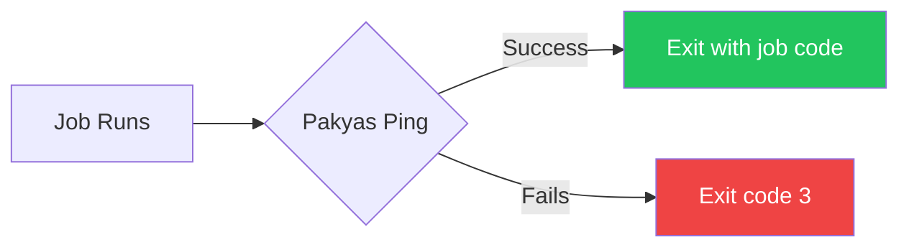
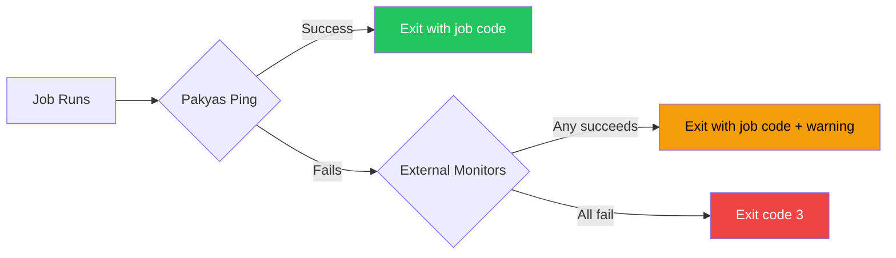

Pakyas CLI supports parallel pinging of external monitoring services, making it easy to migrate from services like healthchecks.io or Cronitor without downtime.

## Overview

When using `pakyas monitor` or `pakyas ping`, you can configure the CLI to simultaneously notify:

- **healthchecks.io** - UUID-based heartbeat monitoring
- **Cronitor** - Telemetry API monitoring
- **Custom webhooks** - POST JSON to your own endpoints

This lets you run both systems in parallel during migration, ensuring no gaps in coverage.

## Inline CLI Arguments

For quick setups or CI/CD environments, you can specify external monitors directly on the command line without creating a config file:

```bash
# With healthchecks.io
pakyas monitor backup-db --healthchecks-id abc123 -- ./backup.sh

# With Cronitor (API key from environment or flag)
CRONITOR_API_KEY=xxx pakyas monitor backup-db --cronitor-key my-monitor -- ./backup.sh

# Or with API key as flag
pakyas monitor backup-db --cronitor-key my-monitor --cronitor-api-key xxx -- ./backup.sh

# With webhook
pakyas monitor backup-db --webhook-url https://my-server.com/hook -- ./backup.sh

# Multiple external monitors at once
pakyas monitor backup-db \
    --healthchecks-id abc123 \
    --cronitor-key my-monitor --cronitor-api-key xxx \
    --webhook-url https://hook1.example.com \
    --webhook-url https://hook2.example.com \
    -- ./backup.sh

# Self-hosted healthchecks.io
pakyas monitor backup-db \
    --healthchecks-id abc123 \
    --healthchecks-endpoint https://hc.internal.example.com \
    -- ./backup.sh
```

### Inline CLI Flags

| Flag | Environment Variable | Description |
|------|---------------------|-------------|
| `--healthchecks-id <uuid>` | `PAKYAS_HEALTHCHECKS_ID` | healthchecks.io check UUID |
| `--healthchecks-endpoint <url>` | `HEALTHCHECKS_ENDPOINT` | Custom endpoint (default: https://hc-ping.com) |
| `--cronitor-key <key>` | `PAKYAS_CRONITOR_KEY` | Cronitor monitor key |
| `--cronitor-api-key <key>` | `CRONITOR_API_KEY` | Cronitor API key |
| `--cronitor-endpoint <url>` | - | Custom endpoint (default: https://cronitor.link) |
| `--webhook-url <url>` | - | Webhook URL (can be repeated) |

**Note:** CLI monitors are merged additively with config file monitors. This means you can define common monitors in your config file and add one-off monitors via CLI arguments.

## Configuration File

For more complex setups with multiple checks, use a config file. Create `~/.config/pakyas/external_monitors.toml`:

```toml
# Migration mode (optional)
# When true, external success can override Pakyas failure
migration_mode = false

# Global settings - shared across all checks
[targets.healthchecks]
endpoint = "https://hc-ping.com"  # Optional, this is the default

[targets.cronitor]
api_key = "your-cronitor-api-key"
endpoint = "https://cronitor.link"  # Optional, this is the default

[targets.webhook]
url = "https://your-webhook.example.com/ping"

# Per-check ID mappings
[checks."backup-db".targets.healthchecks]
uuid = "550e8400-e29b-41d4-a716-446655440000"

[checks."backup-db".targets.cronitor]
monitor_key = "backup-db-monitor"

[checks."payment-sync".targets.healthchecks]
uuid = "770e8400-e29b-41d4-a716-665544002233"

[checks."payment-sync".targets.cronitor]
monitor_key = "payment-sync"
```

### Configuration Structure

- **Global settings** (`[targets.*]`) - Shared endpoints and API keys
- **Per-check mappings** (`[checks."key".targets.*]`) - Monitor IDs for each check, where `key` can be either:
  - A check **slug** (e.g., `"backup-db"`) - used with `pakyas monitor backup-db`
  - A check **public_id** (e.g., `"550e8400-e29b-41d4-a716-446655440000"`) - used with `pakyas monitor --public-id <UUID>`
- Checks without configured IDs skip that external service

## CLI Flags

| Flag | Environment Variable | Description |
|------|---------------------|-------------|
| `--no-external` | `PAKYAS_NO_EXTERNAL` | Disable all external monitors |
| `--migration-mode` | `PAKYAS_MIGRATION_MODE` | Allow external success to override Pakyas failure |
| `--external-timeout-ms` | `PAKYAS_EXTERNAL_TIMEOUT_MS` | Timeout per request (default: 5000ms) |

## Using with public_id (CI/CD)

In CI/CD environments, you often use `--public-id` to avoid authentication requirements. External monitors fully support this mode - just use the public_id as the config key:

```toml
# External monitors config using public_id as the key
[targets.healthchecks]
endpoint = "https://hc-ping.com"

# Use the public_id (UUID) as the key instead of slug
[checks."550e8400-e29b-41d4-a716-446655440000".targets.healthchecks]
uuid = "your-healthchecks-uuid"
```

Then in your CI/CD pipeline:

```bash
# The CLI will look up external monitors using the public_id
pakyas monitor --public-id 550e8400-e29b-41d4-a716-446655440000 -- ./deploy.sh
```

This is useful when:
- Your CI/CD environment doesn't have Pakyas authentication configured
- You want to hardcode the check ID in your pipeline without needing project context
- You're running in a minimal environment where only the public_id is available

**Tip:** When you create a check with `pakyas check create`, the output shows both the slug and public_id monitor commands you can copy:

```
Monitor with:
  pakyas monitor backup-db -- your-command

CI/CD (no auth required):
  pakyas monitor --public-id 550e8400-e29b-41d4-a716-446655440000 -- your-command
```

## Understanding Migration Mode

Migration mode is a **safety net** during the transition from existing monitoring services to Pakyas. It ensures you don't lose monitoring coverage while testing a new system.

### Without Migration Mode (Strict - Default)



If Pakyas fails, you get **exit code 3** even if your job succeeded. This ensures you know your monitoring infrastructure is broken.

### With Migration Mode



If Pakyas fails but your existing monitor (healthchecks.io/cronitor) succeeds, your job exits normally with a warning. This lets you continue relying on your existing monitoring while testing Pakyas.

## Example: Gradual Migration

**Scenario:** You have a nightly backup job monitored by healthchecks.io. You want to add Pakyas monitoring without risking alert gaps.

### Week 1: Run with migration mode

```bash
pakyas monitor --migration-mode backup-db -- ./backup.sh
```

**What happens if Pakyas has a network blip:**

| Component | Status |
|-----------|--------|
| Job | Completes successfully |
| Pakyas ping | Fails (network timeout) |
| Healthchecks.io ping | Succeeds |
| **Result** | Exit code 0 + warning |

You'll see this warning in your logs:

```
Warning: Pakyas ping failed (connection timeout), but external monitor succeeded (migration mode)
```

Your job completes normally, and healthchecks.io confirms it ran. You can investigate the Pakyas issue without any production impact.

### Week 2+: Once confident, disable migration mode

```bash
pakyas monitor backup-db -- ./backup.sh
```

Now any Pakyas failure results in exit code 3, giving you immediate visibility into monitoring issues.

## How It Works (Technical Details)

### Normal Operation (Pakyas succeeds)

1. Pakyas receives ping first (awaited)
2. External monitors receive ping (fire-and-forget)
3. Exit with job's exit code

### Migration Mode (Pakyas fails)

1. Pakyas receives ping (fails)
2. External monitors are awaited (2 second timeout)
3. If any external succeeds → exit with job's exit code + warning
4. If all fail → exit with code 3

### Strict Mode (Default, Pakyas fails)

1. Pakyas receives ping (fails)
2. External monitors receive ping (fire-and-forget)
3. Exit with code 3 (monitoring failure)

## Exit Codes

| Code | Meaning |
|------|---------|
| 0 | Job succeeded, Pakyas ping succeeded |
| 1-2 | Job failed (original exit code) |
| 3 | Monitoring infrastructure failure |

Exit code 3 means Pakyas couldn't be reached. In migration mode, this only happens if *all* monitors failed.

## Migration Workflow

### Step 1: Create Pakyas Checks

Create Pakyas checks that mirror your existing healthchecks.io or Cronitor monitors:

```bash
pakyas check create --name "Nightly Backup" --slug backup-nightly --period 86400 --grace 3600
```

### Step 2: Configure External Monitors

Create `~/.config/pakyas/external_monitors.toml` with your existing monitor IDs:

```toml
migration_mode = true

[targets.healthchecks]
endpoint = "https://hc-ping.com"

[checks."backup-nightly".targets.healthchecks]
uuid = "your-healthchecks-uuid"
```

### Step 3: Run with Migration Mode

Use migration mode during the transition period:

```bash
pakyas monitor --migration-mode backup-nightly -- ./backup.sh
```

Or set it globally via environment:

```bash
export PAKYAS_MIGRATION_MODE=true
pakyas monitor backup-nightly -- ./backup.sh
```

### Step 4: Monitor for Warnings

Watch your logs for warnings like:

```
Warning: Pakyas ping failed (connection error), but external monitor succeeded (migration mode)
```

These indicate Pakyas reliability issues that should be investigated.

### Step 5: Disable Migration Mode

Once you're confident Pakyas is working reliably:

```bash
pakyas monitor backup-nightly -- ./backup.sh  # No --migration-mode
```

### Step 6: Remove External Config

When ready to fully migrate, remove external monitor configuration:

```bash
rm ~/.config/pakyas/external_monitors.toml
```

## Examples

### Basic Migration Setup

```bash
# Configure external monitors
cat > ~/.config/pakyas/external_monitors.toml << 'EOF'
migration_mode = true

[targets.healthchecks]
endpoint = "https://hc-ping.com"

[checks."nightly-backup".targets.healthchecks]
uuid = "your-healthchecks-uuid"
EOF

# Run with migration mode
pakyas monitor nightly-backup -- ./backup.sh
```

### Multiple Services

```toml
migration_mode = true

[targets.healthchecks]
endpoint = "https://hc-ping.com"

[targets.cronitor]
api_key = "abc123"

[checks."backup-db".targets.healthchecks]
uuid = "550e8400-..."

[checks."backup-db".targets.cronitor]
monitor_key = "backup-db-monitor"
```

### Custom Webhook

```toml
[targets.webhook]
url = "https://status.example.com/api/ping"

# Webhook receives JSON payload:
# {
#   "check_identifier": "backup-db",  // slug or public_id depending on invocation
#   "event_type": "success",  // or "start", "fail"
#   "exit_code": 0,
#   "duration_ms": 12345,
#   "timestamp": "2025-01-02T10:00:00Z",
#   "host": "server1.example.com",
#   "output": "..."  // stderr tail, max 4KB
# }
```

### Temporarily Disable External Monitors

```bash
# Via flag
pakyas monitor --no-external backup-nightly -- ./backup.sh

# Via environment
export PAKYAS_NO_EXTERNAL=true
pakyas monitor backup-nightly -- ./backup.sh
```

### Custom Timeout

```bash
# Increase timeout for slow external services
pakyas monitor --external-timeout-ms 10000 backup-nightly -- ./backup.sh
```

## Troubleshooting

### External pings not being sent

1. Check that `external_monitors.toml` exists at `~/.config/pakyas/external_monitors.toml`
2. Verify the config key matches exactly (case-sensitive):
   - If using slug: `[checks."your-slug".targets.healthchecks]`
   - If using public_id: `[checks."550e8400-e29b-41d4-a716-446655440000".targets.healthchecks]`
3. Ensure the per-check ID mapping exists for your check
4. Use `-v` (verbose) flag to see which config key is being used for lookup

### Getting exit code 3 unexpectedly

Exit code 3 means Pakyas ping failed. In strict mode, this happens even if your job succeeded.

Options:
- Enable `--migration-mode` during transition
- Check network connectivity to Pakyas
- Verify authentication is working (`pakyas whoami`)

### Migration mode not working

Migration mode only saves you if:
1. Pakyas fails AND
2. At least one external monitor succeeds

If all monitors fail, you still get exit code 3.

## Environment Variables

### General Settings

| Variable | Description |
|----------|-------------|
| `PAKYAS_NO_EXTERNAL` | Disable all external monitors |
| `PAKYAS_MIGRATION_MODE` | Enable migration mode (lenient failures) |
| `PAKYAS_EXTERNAL_TIMEOUT_MS` | Timeout per external request (default: 5000) |

### Inline External Monitor Settings

These environment variables can be used instead of CLI flags for inline external monitor configuration:

| Variable | Description |
|----------|-------------|
| `PAKYAS_HEALTHCHECKS_ID` | healthchecks.io check UUID |
| `HEALTHCHECKS_ENDPOINT` | Custom healthchecks.io endpoint |
| `PAKYAS_CRONITOR_KEY` | Cronitor monitor key |
| `CRONITOR_API_KEY` | Cronitor API key |

**Note:** With inline CLI arguments or environment variables, you no longer need a config file for simple setups. Config files are still useful for managing multiple checks with different external monitor mappings.
